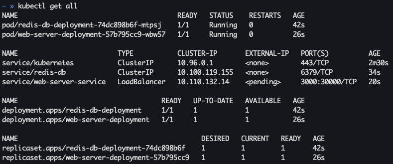
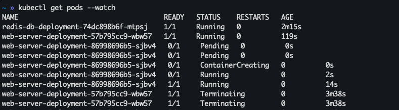
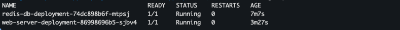

# Run the application deployment scenarios

Repository for the **T4-04.05 - Examples of Application Deployment** hands-on lesson.

## Scenario 1 - Running a single Docker application

**Prerequisites:**
You have installed both Docker locally.

```bash
cd docker-simple-app
```

1. Build the Docker image from the Dockerfile (use `-t` to tag the image with a name, the current directory `.` is the build context for the image).

```bash
docker build -t epicode/simple-server-app .
```

2. Create a running Docker container from the image, detached, and with port mapping defined between port `3000` on your host machine (where you want to receive traffic) and port `3000` within the container (that's listening for connections).

```bash
docker run -d -p 3000:3000 epicode/simple-server-app
```

When the container is running, the server is running.

You can open your browser and go to http://localhost:3000. You should see this JSON response:

```json
{
  "app": "simple-web-server",
  "version": "1.0",
  "message": "Hello from simple-web-server v1.0!"
}
```

3. Stop the container to stop the server.

## Scenario 2 - Running a composed Docker application

**Prerequisites:**
You have installed both Docker and Docker compose locally.

```bash
cd docker-composed-app
```

1. Build the image of the `Node.js` web server application from the Dockerfile (it's an extended version of the simple web server in the previous scenario).
The current directory `.` is the build context for the image, a port mapping is configured to map port `3000` on the local host to port `3000` on the Docker container, where the server is listening for connections. After that, create a running Docker container of the web server application from the custom image created, and a running Docker container for the Redis DB service from the official redis image available in the Docker Hub.

```bash
docker-compose up     // create and start node-web-server and redis-db services and the network connecting them
```

When the containers are running, the server is running.

You can open your browser and go to http://localhost:3000. You should see this JSON response:

```json
{
  "app": "simple-web-server",
  "version": "1.0",
  "message": "Hello from simple-web-server v1.0!",
  "visits": "Total visits: 1"
}
```

If you refresh the web page, you should see the visits counter increasing. It is incremented every time there is a new visit to the web page.

2. Stop the containers to stop the server.

```bash
docker-compose stop   # stop node-web-server and redis-db services

docker-compose down   # stop and remove node-web-server and redis-db services and the network connecting them
```

**Question:** What happens if you deploy again the containers? What is the new value of the visits counter?

## Scenario 3 - Running a composed Docker application with persistent storage

**Prerequisites:**
You have installed both Docker and Docker compose locally.

```bash
cd docker-composed-app-persistent-storage
```

1. Create a volume for persistent data storage.

```bash
docker volume create --name=redis-db-persistent-data
```

2. Now, follow the same steps of **Scenario 2**. The redis-db container will be attached to the volume you just created.

```bash
docker-compose up     # create and start node-web-server and redis-db services and the network connecting them

docker volume ls      # check the volume
```

As in **Scenario 2**, when the containers are running, the server is running.

You can open your browser and go to http://localhost:3000. Refresh the web page as many times as you want, you should see the visits counter increasing accordingly.

3. Stop the containers to stop the server.

```bash
docker-compose stop   # stop node-web-server and redis-db services

docker-compose down   # stop and remove node-web-server and redis-db services and the network connecting them
```

**Question:** What happens now if you deploy again the containers? What is the new value of the visits counter?

## Scenario 4 - Deploying your app with Kubernetes

**Prerequisites:**
You have installed both Minikube and Kubectl locally.

```bash
cd kubernetes-app

minikube start        # if config is ok, you should see something like `kubectl is now configured to use "minikube" cluster and "default" namespace by default`
kubectl cluster-info  # if config is ok, you should see something like `Kubernetes control plane is running at ... CoreDNS is running at ...`
```

1. Create the web server application image and make it available to your Kubernetes cluster. For local clusters, build and load it into the cluster.

```bash
docker build -t simple-web-server:1.0 .
minikube image load simple-web-server:1.0

# or use the kind command
kind load docker-image simple-web-server:1.0
```
<!--
2. Setup application accessibility. We want to expose the web server running on Minikube. A LoadBalancer service is the standard way to expose a service to the internet. With this method, each service gets its own IP address. Services of type LoadBalancer can be exposed via the minikube tunnel command. It **must be run in a separate terminal window** to keep the LoadBalancer running. Ctrl-C in the terminal can be used to terminate the process at which time the network routes will be cleaned up. [[minikube-docs](https://minikube.sigs.k8s.io/docs/handbook/accessing/)]

```bash
minikube tunnel

minikube service web-server-service --url
```
-->

2. Create deployments and services (follow service dependencies).

```bash
kubectl apply -f redisdb-deployment.yaml
kubectl apply -f redisdb-service.yaml

kubectl apply -f webserver-deployment.yaml
kubectl apply -f webserver-service.yaml
```

3. Use port forward in minikube to test the web server service.

```bash
kubectl port-forward service/web-server-service 3000:3000
```

You can open your browser and go to http://localhost:3000. Refresh the web page as many times as you want, you should see the visits counter increasing accordingly. This example is the one without storage persistence in place. So, if you stop the containers, or delete the cluster, and then re-start/re-deploy everything, the counter will start again from `0`.

4. Check and manage your cluster.

```bash
minikube status
minikube pause
minikube unpause
minikube stop
minikube delete
```

5. Check and manage your deployed services.

```bash
kubectl get nodes
kubectl get pod
kubectl get service
kubectl get all
```

5. Remove deployments and services (inverse order w.r.t. creation to respect service dependencies).

```bash
kubectl delete -f webserver-deployment.yaml
kubectl delete -f webserver-service.yaml

kubectl delete -f redisdb-deployment.yaml
kubectl delete -f redisdb-service.yaml
```

## Scenario 5 - Deploying a rolling update of your app with Kubernetes

**Prerequisites:**
You have installed both Minikube and Kubectl locally. You have a DockerHub account.

```bash
cd kubernetes-app-update

minikube start
```

1. Create a repository on your DockerHub personal space named `simple-web-server`. Create the web server application image and publish it to DockerHub.

```bash
docker build -t simple-web-server:1.0 .

docker tag simple-web-server:1.0 <dockerhub-username>/simple-web-server:1.0   # docker tag local-image:tagname new-repo:tagname
docker push <dockerhub-username>/simple-web-server:1.0                        # docker push new-repo:tagname
```

2. Update the `webserver-deployment.yaml` with the image name from DockerHub.

```yaml
containers:
  - name: node-web-server
    image: <dockerhub-username>/simple-web-server:1.0
    ports:
      - containerPort: 3000
    env:
      - name: APP_VERSION
        value: "1.0"
```

2. Create deployments and services (follow service dependencies).

```bash
kubectl apply -f redisdb-deployment.yaml
kubectl apply -f redisdb-service.yaml

kubectl apply -f webserver-deployment.yaml
kubectl apply -f webserver-service.yaml

minikube service web-server-service  # open the service in your browser using a reachable URL address and the nodePort defined in `webserver-service.yaml`
```

The service will be automatically opened in your default browser. If you're running minikube with Docker Desktop as the container driver, a minikube tunnel is needed. This is because containers inside Docker Desktop are isolated from your host computer. The tunnel is automatically created in this case. The terminal (and consequently the tunnel) needs to be open to keep your service reachable.

Refresh the web page as many times as you want, you should see the visits counter increasing accordingly. This example is the one without storage persistence in place. So, if you stop the containers, or delete the cluster, and then re-start/re-deploy everything, the counter will start again from `0`.

3. Watch the pods in a new terminal (and leave it open).

```bash
kubectl get pods --watch
```

4. Create an updated version of the web server application image and publish it to DockerHub.

```bash
docker build -t simple-web-server:1.1 .

docker tag simple-web-server:1.1 <dockerhub-username>/simple-web-server:1.1   # docker tag local-image:tagname new-repo:tagname
docker push <dockerhub-username>/simple-web-server:1.1                        # docker push new-repo:tagname
```

5. Update the `webserver-deployment.yaml` to use the new application version and re-run `kubectl apply` to start the rolling update.

```yaml
containers:
  - name: node-web-server
    image: <dockerhub-username>/simple-web-server:1.1
    ports:
      - containerPort: 3000
    env:
      - name: APP_VERSION
        value: "1.1"
```

```bash
kubectl apply -f webserver-deployment.yaml
```
<!--
# or use
kubectl set image deployment/simple-web-server app=simple-web-server:1.1
```
-->

Observe the application during the rolling update. Throughout the update users experience zero downtime.

Before the update:


During the update:


After the update:

